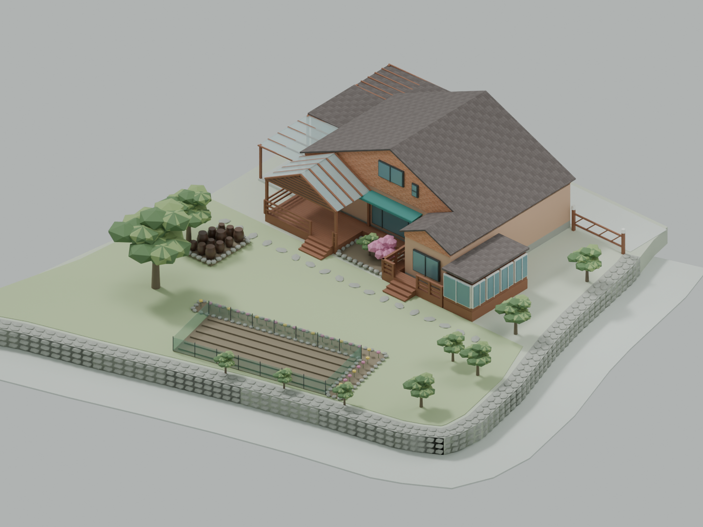

# Family Camera Companion

부모님이 광고 없이 집의 카메라를 확인하고 조작할 수 있도록 만드는 개인 프로젝트입니다.
카메라를 샀는데도 전용 앱에서 광고를 봐야 하는 불편함에서 시작했습니다.

공개 저장소는 **코드와 집의 3D 모델, 가상 카메라 데모**를 담습니다.
실제 카메라 연결 정보와 가족 데이터는 포함하지 않습니다.



## Run the Demo

Node 22.22 이상 또는 Node 24가 필요합니다.

```sh
npm ci
npm run dev
```

기본 주소는 `http://localhost:4180`입니다. 포트를 쓰고 있다면
`PORT=4181 npm run dev`처럼 변경할 수 있습니다. 실제 장치, 계정,
환경변수 없이 3D·평면도·가상 카메라 5개·모의 PTZ를 확인할 수 있습니다.
외부 광고·분석 도구·카메라 클라우드에 연결하지 않습니다.

## Current Evidence

| 영역 | 구현 / 확인 범위 | 아직 확인하지 않은 것 |
| --- | --- | --- |
| 집 3D·평면도 | Blender 원본, GLB, 19개 구역, 형상 회귀 테스트 | 실측 치수·실내·지적 경계 |
| 공개 PTZ | 가상 장면의 pan/tilt/zoom, 정지·초기화·시간 제한 | 실제 장치의 이동·정지 |
| 가족 기기 승인 | 승인·세션·만료·해제·권한·재시작 테스트 | 부모님 실사용·원격 배포 |
| 영상 저장 | 스냅샷·수동 녹화 코드, 합성 영상 FFmpeg 테스트 | 공개 추출본의 실카메라 검증 |
| 실제 카메라 어댑터 | 선택적으로 실행하는 ONVIF/RTSP 프로토타입 | 일반 장치 호환성·음성·SD 재생·AI |

**모의 영상과 자동 테스트 통과는 실제 카메라 연동 성공을 뜻하지 않습니다.**
기존 비공개 환경과 이 공개용 추출본의 검증 결과도 구분합니다.
상세 내용: [구조와 한계](docs/architecture.md), [검증 기록](docs/validation.md).

## Source Map

| 경로 | 내용 |
| --- | --- |
| `src/` | Three.js 모델/평면도와 네트워크 없는 PTZ 데모 |
| `public/assets/` | 공개 승인된 집 모델·배치 데이터·모델 렌더 |
| `assets/models/` | 편집 가능한 Blender 원본, 검증·감사 기록 |
| `scripts/` | 모델 생성·검증, 번들, 정적 서버, 공개 전 점검 |
| `server/` | 실제 장치용 선택적 어댑터와 기기 승인·저장 로직 |
| `docs/` | 설계 결정, 개발 기록, 검증 범위 |

선택적 서버는 외부 비공개 설정 없이는 시작하지 않습니다.
설정·DB·영상은 저장소 밖에 둡니다. [실장치 어댑터 문서](docs/private-adapter.md)를
검토한 뒤 별도의 비공개 환경에서만 검증합니다.

## Verify and Rebuild

```sh
npm run check
blender --background --python scripts/build-villa.py
blender --background --python scripts/verify-villa.py
# 모델과 내장 자산을 직접 검토한 다음에만:
node scripts/seal-model.mjs
```

Blender 5.2에서 원본을 생성·검증했습니다. Node CI는 형상 데이터와 GLB,
코드·합성 미디어·감사 해시를 검사하며 Blender를 다시 실행하지는 않습니다.

## Development Process

[개발 기록](docs/development-log.md)에 초기 비공개 작업과 공개 이후를 구분합니다.
변경은 **Issue → branch → PR → CI → merge**로 기록합니다.
AI 보조 구현과 자체 검토를 사용하며 독립적인 사람의 리뷰로 표시하지 않습니다.
원본 사진, 위성·로드뷰 이미지, 실제 카메라 배치, 장치 ID, 가족 정보,
실제 영상은 코드뿐 아니라 이슈·PR 첨부물에서도 제외합니다.

다음 단계:
[실카메라 1대 검증 #2](https://github.com/BlueStylo/family-camera-companion/issues/2),
[PTZ 정지 안전성 #3](https://github.com/BlueStylo/family-camera-companion/issues/3),
[부모님 사용성 #4](https://github.com/BlueStylo/family-camera-companion/issues/4),
[비공개 원격·저장 경계 #5](https://github.com/BlueStylo/family-camera-companion/issues/5).

## Licenses

- Code and documentation: [MIT](LICENSE).
- House model, site-specific data and renders: [separate terms; license pending](MODEL_LICENSE.md).
- 실제 집의 외형은 소유자의 결정으로 공개합니다. 위치 정보와 원본 사진을
  제외하더라도 형태 자체의 식별 가능성까지 없어진다는 뜻은 아닙니다.

See [CONTRIBUTING.md](CONTRIBUTING.md) and [SECURITY.md](SECURITY.md).
